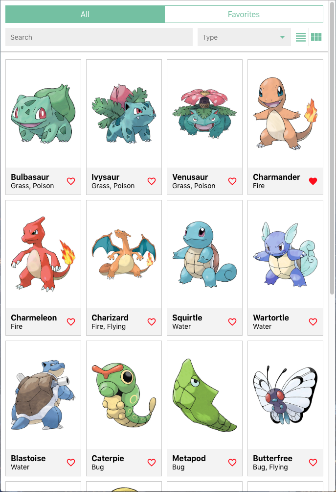

# Challenges Coding Exercise Frontend

We have provided you with a simple GraphQL server that serves Pokemon data. The server is non-persistent and therefore on server restart, data will reset. Using the provided server, your mission is to build a small application that should be able to: 

- Search for Pokemon by text through use of a search bar.
- Filter Pokemon by type using a dropdown.
- Add and remove a Pokemon to and from your Favorites by clicking the heart icon.
- Use tabs to switch between `All` Pokemon and `Favorite` Pokemon views.
- Change the view from either a grid or list.
- View Pokemon details using a `/:name` route.
- Clicking on a Pokemon image or name should navigate to the above route to view the Pokemon details.
- On the Pokemon details page, have a speaker icon that, when clicked, plays the sound of that Pokemon.

In addition to the above features, below are some optional features that we'd love to see at least one of:
- Infinitely scrolled or paginated list to handle on-demand data-fetching for the long list of Pokemon.
- Add a quick view button on the Pokemon list items that shows a modal with more information of the Pokemon.
- Add toast notifications to show success or error messages when adding or removing a Pokemon to and from your Favorites.

### Technology and boilerplate

You are free to use whatever stack you want but what we value the most is [React](https://github.com/facebook/react). We have put together a boilerplate that includes packages and folders ready to create a flow similar to our app including:

- React.
- React Router.
- React Apollo.
- GraphQL.
- Typescript.
- Styled Components.

Use only what you are comfortable with and feel free to use any additional libraries you deem necessary to complete the exercise. **However**, Please refrain from using any component libraries such as React Toolbox, React Material UI, etc. as we would like to see your CSS skills.

### Example

A video example can be found in the example folder in the root of the directory as `example.mov`

List View           |  Detail View
:-------------------------:|:-------------------------:
 |  


### Getting started

#### Run the server
```
$ cd backend
$ npm install
$ npm start
```

#### Run the frontend
```
$ cd frontend
$ npm install
$ npm start
```

#### Hints
- React recently announced their [Hooks API](https://reactjs.org/docs/hooks-intro.html). We'd love to see you try and use Hooks in your app.
- If you access the `/graphql` endpoint in the browser, you'll be presented with a GraphQL Playground that allows you to run Queries and Mutations as well as view the GraphQL Schema.
- There is no need to configure a build, the development env. is sufficient.
- **Tests** are important and if time allows it, we'd like to see *some* test coverage.